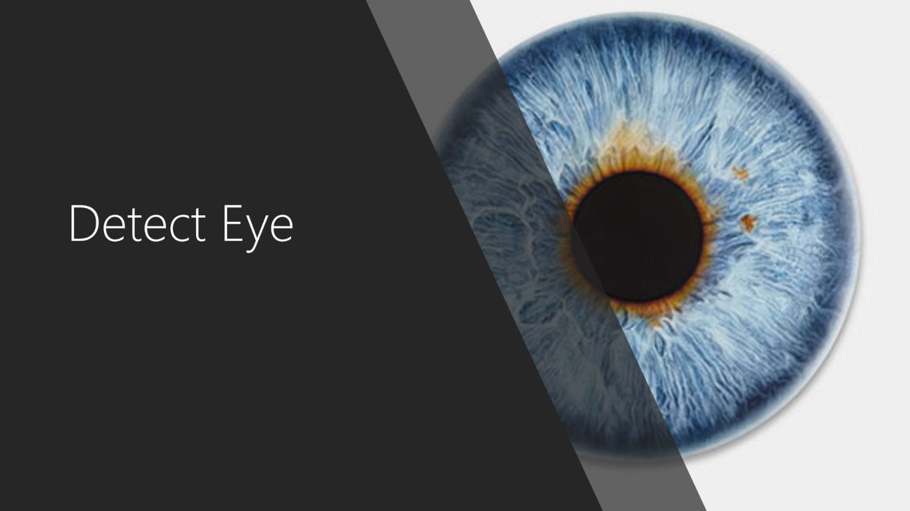
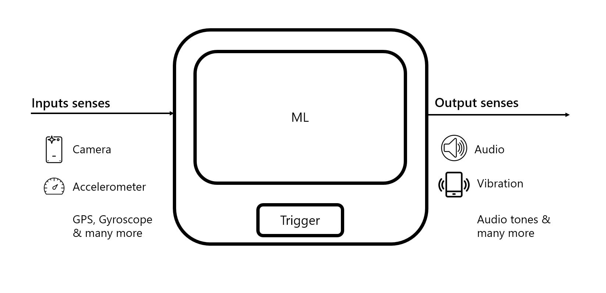

# Detect Eye
The goal of the project is to:
1. Facilitate a person to navigate within confined spaces (like rooms in houses or hostel) without bumping into common objects like furniture, walls etc. In the application we intend to help people to be able to walk in such places with confidence.
2. To be accessible for all diverse audience is one of the key goals.

This project was created as part of a I-Stem Hackathon 2018 initiative over 24hours during 20 Jan - 21 Jan 2018 done by Venkatesh Potluri, Pratyush Kaushal, Palash Gupta, Sai Krishna Mundrati & Anoob Backer.

## Android application
This project uses straightforward samples of using TensorFlow for mobile applications. 

We've leveraged the TensorFlow example - [TF Detect](https://github.com/tensorflow/tensorflow/blob/master/tensorflow/examples/android/src/org/tensorflow/demo/DetectorActivity.java) and added support for text to voice & vibration support.

Our approach is to leverage machine learning to identify the objects real time to provide multi-mode feedback to users.

We're hosting this online so that all of planet can collaborate to make it a better solution.